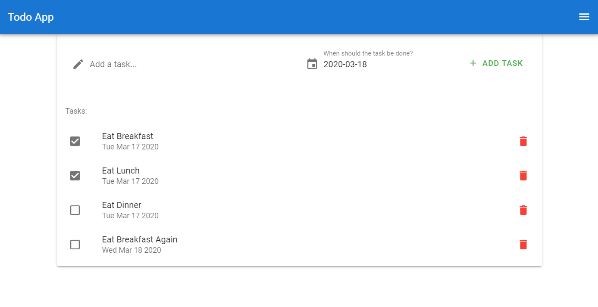

# Lab 5B - Vue.js Front-End App

## Overview
This lab is a direct continuation of Lab 5A. In the previous lab, you completed the first component in `AppBar.vue`. For this lab, you will complete the remaining two components and deploy your app using the vue-cli-service build feature.



### Functionality

- Front-end only framework that communicates with a backend

### Concepts

- Vue.js
  - Build Tools (webpack)
  - Single-Page Apps
  - Components
    - Props
    - Data
    - Methods
    - Computed
- CI/CD Pipelines
- XHR Requests (AJAX)
  - `fetch()` Browser API
- Progressive Web Apps (PWA)

### Resources

- [What is Vue.js?](https://vuejs.org/v2/guide/#What-is-Vue-js)
- [Vue CLI](https://vuejs.org/v2/guide/installation.html#CLI)
- [Vue.js devtools](https://chrome.google.com/webstore/detail/vuejs-devtools/nhdogjmejiglipccpnnnanhbledajbpd?hl=en)

### Assignments

Lab Writeup Instructions are in the "Content" tab in [Learning Suite](https://learningsuite.byu.edu).

## Instructions

#### Components

2. `src/components/TaskList.vue`

   - We provide this file for you, [download or copy it from here](TaskList.vue) and put it in the `src/components` folder
   - Finish the component by taking care of all of the `TODO` comments

3. `src/components/NewTaskForm.vue`

   - We provide this file for you, [download or copy it from here](NewTaskForm.vue) and put it in the `src/components` folder
   - Finish the component by taking care of all of the `TODO` comments

### Step 5: Deploy Your App

To deploy your Vue app, you will be using the vue-cli-service build feature. This will convert your Vue application into static HTML, CSS, and Javascript that can be served normally by Apache2.

1. Make sure your front-end works with your backend, and that there are no errors

2. Push your finalized code to GitHub

3. Clone your code onto your AWS server

4. Create a .env file and set the `VUE_APP_API_ORIGIN` to your API's production server domain at port 1337 (`https://<your-domain>:1337`)

5. Run `npm install` to install all required packages

6. Navigate to the root of the project and run `npm run build`. If you get an error, run this command `export NODE_OPTIONS=--openssl-legacy-provider` then run `npm run build ` again
>Note: If you get a chance, you can run `npm run build` in VSCode, and check out the `dist` folder to see what your Vue project becomes: Plain-old HTML, CSS and JavaScript!

7. Create a symbolic link that points to the `dist` directory created by the previous command
  - cd to `/var/www`
  - Delete the old symbolic link if it exists: `rm -rf html`
  - Create a new symbolic link: `ln -s <path-to-your-6b-code>/dist html`
  
8. Add apache to your ufw firewall
  ```sh
  sudo ufw allow 'Apache Full'
  ```

>You can check out the site by going to your AWS server's IP address or the domain name you created in lab 4B

9. You may open the site if you wish, but it won't work quite yet

   - Make sure your API (Lab 4B) is up to date on GitHub
   - cd into your lab 4B folder
   - Pull any changes you made from GitHub
   - Modify the `.env` file to have all of the variables it has in your development repo, except make sure there are no IP addresses, but domains instead
   - Also make sure `PORT=1337`
   - There should be no slashes at the end of any URLs
   - Run `npm i`
   - If you haven't already, install `pm2` using `npm i -g pm2`
   - Run `pm2 start server.js` from the root of your project
   - Make sure your server is up by running `pm2 list`
   - You can view any outputs from that program using `pm2 logs` (exit with <kbd>Ctrl-c</kbd>)
   - Remember, if you need to stop it, run `pm2 stop all`
   - Log on to [console.developers.google.com](https://console.developers.google.com/apis/credentials), click on your OAuth client, and add
     ```
     https://<Your_Custom_Domain.ddns.net>/api/v1/auth/google/callback
     ```
     to your list of authorized redirect URIs
     

# Vue.js Front-End App Passoff

- [ ] 5 Points - First commit is on or before Friday
- [ ] 5 Points - Source code is pushed to GitHub
- [ ] 15 Points - Site is live and functional on your AWS server
- [ ] 5 Points - Secrets are protected
- [ ] 10 Points - Users cannot see the list of tasks unless they are logged in
- [ ] 5 Points - Tasks are stored in MongoDB Atlas
- [ ] 20 Points - A logged-in user can create, update and delete tasks

> For extra credit to apply all passoff requirements need to be met

# Extra Credit
 
> Note: TAs cannot help you with extra credit!

- [ ] 10 Points - Show user's Google photo and name instead of their email on the side drawer
  - HINT: You'll have to change the backend to include another scope when authenticating with Google, then pass that data to the front-end somehow
  - This is the same extra credit as Part 1. You only get to claim it once.

# Writeup Questions

- Why use Vue over other web frameworks that you have experience with?
- Explain a situation where it would make sense to use a computed property instead of a property in the `data` object
- Why are Vue projects called "single-page applications"? What does that mean?

# Also...

Your website is a [PWA (Progressive Web Application)](https://blog.bitsrc.io/what-is-a-pwa-and-why-should-you-care-388afb6c0bad), so you should try to install it as an app on your phone or your desktop!

# Sources:
- props explained:
- Vue 3 documentation
- methods documentation/explained:
